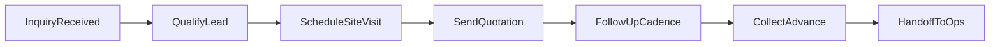

# Banquet Client Follow-Up & Objection Handling Training Manual

**Version:** 1.0  
**Audience:** Sales executives, front-desk staff, banquet coordinators  
**Focus:** Pre-booking (inquiry → site visit → quotation → advance), with light post-booking handoff  
**Business type:** Mixed banquet — weddings, corporate events, and social occasions

---

## Company-Specific Settings (Fill Before Training)

| Setting                               | Your Value                                                                            |
| ------------------------------------- | ------------------------------------------------------------------------------------- |
| Venue name                            | `[COMPANY TO FILL]`                                                                   |
| Location(s)                           | `[COMPANY TO FILL]`                                                                   |
| Hall names & capacity                 | `[COMPANY TO FILL]` — e.g., Grand Hall (50–500), Crystal Room (30–150)                |
| Pricing model                         | `[COMPANY TO FILL]` — e.g., per-plate, hall rental + catering, all-inclusive packages |
| Minimum per-plate / package floor     | `[COMPANY TO FILL]`                                                                   |
| Advance to block date                 | `[COMPANY TO FILL]` — e.g., 25% within 7 days of confirmation                         |
| Max discount without manager approval | `[COMPANY TO FILL]` — e.g., 5% or ₹0                                                  |
| Complimentary value-adds allowed      | `[COMPANY TO FILL]` — e.g., welcome drink, upgraded linen                             |
| Tasting policy                        | `[COMPANY TO FILL]` — e.g., complimentary for 50+ pax bookings                        |
| Site visit hours                      | `[COMPANY TO FILL]` — e.g., 11 AM – 7 PM daily                                        |
| Languages for client communication    | `[COMPANY TO FILL]` — e.g., English, Hindi, Marathi                                   |
| CRM / lead tracker                    | `[COMPANY TO FILL]` — e.g., Excel, Zoho, LeadSquared                                  |

---

## Table of Contents

1. [Introduction & Role Expectations](#1-introduction--role-expectations)
2. [Client Journey Map](#2-client-journey-map-pre-booking)
3. [Lead Qualification Checklist](#3-lead-qualification-checklist)
4. [Follow-Up Playbook](#4-follow-up-playbook)
5. [Objection Handling Framework](#5-objection-handling-framework)
6. [Event-Type Playbooks](#6-event-type-playbooks)
7. [Walk-In & Site Visit SOP](#7-walk-in--site-visit-sop)
8. [CRM & Documentation Standards](#8-crm--documentation-standards)
9. [Role-Play Scenarios](#9-role-play-scenarios)
10. [Quick-Reference Checklists](#10-quick-reference-checklists)
11. [KPIs & Quality Standards](#11-kpis--quality-standards-for-managers)

---

## 1. Introduction & Role Expectations

### 1.1 Purpose

Banquet sales is not about pushing a booking on the first call. It is about **guiding the client** from curiosity to confidence — and doing that faster and more professionally than competitors.

Your job in pre-booking is to:

- Respond quickly and warmly
- Qualify whether we are the right fit
- Schedule site visits for serious leads
- Send accurate quotations
- Follow up with **value**, not pressure
- Handle objections calmly and move toward advance payment

**Success looks like:** Qualified lead → Site visit → Quotation sent → Advance received → Handoff to operations.

### 1.2 What You Represent

Every message, call, and visit shapes how the client imagines their event at our venue. You are the first impression of our service quality. If follow-up is slow, vague, or pushy, they assume the event day will be the same.

### 1.3 Tone Standards

| Do                                                 | Don't                                                      |
| -------------------------------------------------- | ---------------------------------------------------------- |
| Be warm, respectful, and clear                     | Be aggressive or guilt-trip ("You'll regret waiting")      |
| Use the client's name                              | Use only generic "Sir/Madam" after you know their name     |
| Acknowledge family/corporate decision time         | Rush or dismiss "we need to discuss"                       |
| Give honest answers about availability and pricing | Promise dates, discounts, or inclusions you cannot confirm |
| Set specific next steps                            | End calls with "Call me if interested"                     |

### 1.4 Channel Etiquette Quick Rules

**WhatsApp**

- Primary channel for weddings and social events in India
- Business hours: 9 AM – 9 PM for outbound messages (unless client messages first at night — reply briefly, schedule call for next day)
- Use short paragraphs; one clear ask per message
- Send photos/PDFs; avoid voice notes unless client prefers them
- Always identify yourself: venue name + your name

**Phone**

- Best for hot leads, objections, and decision-makers
- Call back within 15 minutes if you missed an inbound call during business hours
- Speak slowly; confirm details by repeating back
- After every call, send a WhatsApp summary of what was agreed

**Email**

- Required for corporate clients and formal quotations
- Professional subject line: `Quotation – {Event Type} – {Date} – [COMPANY TO FILL]`
- Attach PDF quotation; keep body under 10 lines
- Copy manager only when escalated

**Walk-in / In-person**

- Stand, greet, offer seating and water/tea
- Never leave a walk-in unattended for more than 2 minutes
- Tour before heavy selling — let the space create desire

**CRM / Lead tracker**

- Update within 30 minutes of every interaction
- If it is not in CRM, it did not happen

---

## 2. Client Journey Map (Pre-Booking)

### Stage 1: Inquiry Received

| Item              | Detail                                                            |
| ----------------- | ----------------------------------------------------------------- |
| **Owner**         | First available sales executive; assigned owner within 1 hour     |
| **Trigger**       | WhatsApp, phone, website form, walk-in, referral, aggregator lead |
| **Required data** | Name, phone, event type, preferred date(s), guest count, source   |
| **Next action**   | Qualify within first conversation (5–10 min)                      |
| **Deadline**      | First response within **15 minutes** during business hours        |
| **CRM status**    | `New` → `Contacted`                                               |

### Stage 2: Qualify Lead

| Item              | Detail                                                             |
| ----------------- | ------------------------------------------------------------------ |
| **Owner**         | Assigned sales executive                                           |
| **Goal**          | Confirm fit: date availability, capacity, budget range             |
| **Required data** | Budget range, date flexibility, decision-maker, visit availability |
| **Next action**   | Schedule site visit OR politely close / nurture                    |
| **Deadline**      | Same day as first contact                                          |
| **CRM status**    | `Qualified` or `Disqualified` / `Nurture`                          |

**Disqualify politely when:**

- Date is not available and no alternate date works
- Guest count is below minimum or above maximum capacity
- Budget is far below floor with no flexibility
- Client is only price-collecting with no intent (after 2 value-add follow-ups)

### Stage 3: Schedule Site Visit

| Item              | Detail                                                    |
| ----------------- | --------------------------------------------------------- |
| **Owner**         | Sales executive                                           |
| **Required data** | Visit date/time, attendees (who is coming), halls to show |
| **Next action**   | Send visit confirmation on WhatsApp with location pin     |
| **Deadline**      | Visit within 3–5 days of inquiry for hot dates            |
| **CRM status**    | `Visit Scheduled`                                         |

### Stage 4: Site Visit Completed

| Item              | Detail                                                                  |
| ----------------- | ----------------------------------------------------------------------- |
| **Owner**         | Sales executive who conducted tour                                      |
| **Required data** | Halls shown, package interest, menu tier, decor level, objections heard |
| **Next action**   | Same-day thank-you message; prepare quotation                           |
| **Deadline**      | Quotation within **24–48 hours** of visit                               |
| **CRM status**    | `Visit Done` → `Quotation Pending`                                      |

### Stage 5: Quotation Sent

| Item              | Detail                                                                           |
| ----------------- | -------------------------------------------------------------------------------- |
| **Owner**         | Sales executive                                                                  |
| **Required data** | Quote version, inclusions, exclusions, validity date, per-plate or package total |
| **Next action**   | Begin follow-up cadence (Section 4)                                              |
| **Deadline**      | Quote validity: `[COMPANY TO FILL]` — e.g., 7 days                               |
| **CRM status**    | `Quoted`                                                                         |

### Stage 6: Negotiation / Objection Handling

| Item              | Detail                                                         |
| ----------------- | -------------------------------------------------------------- |
| **Owner**         | Sales executive; escalate per discount policy                  |
| **Required data** | Objections tagged, competitor name if mentioned, counter-offer |
| **Next action**   | Revised quote, manager call, or hold-date offer                |
| **Deadline**      | Respond to objections within **same business day**             |
| **CRM status**    | `Negotiating`                                                  |

### Stage 7: Advance Collected (Booked)

| Item              | Detail                                                  |
| ----------------- | ------------------------------------------------------- |
| **Owner**         | Sales executive + accounts                              |
| **Required data** | Advance amount, payment mode, receipt, signed agreement |
| **Next action**   | Block date in system; handoff to operations             |
| **Deadline**      | Date blocked only after advance clears per policy       |
| **CRM status**    | `Booked`                                                |

### Stage 8: Handoff to Operations (Light)

Share with ops team within **24 hours** of booking:

- Client POC name and phone
- Event date, hall, guest count
- Menu package and special dietary needs
- Decor level and add-ons
- Payment schedule and balance due date
- Any verbal promises made (must match contract)

**CRM status:** `Handed Off`

### CRM Status Summary

`New` → `Contacted` → `Qualified` → `Visit Scheduled` → `Visit Done` → `Quoted` → `Negotiating` → `Booked` → `Handed Off`

Alternate exits: `Nurture` (future date) | `Lost` (with reason code)

---

## 3. Lead Qualification Checklist

Use this on **every first contact**. Goal: 5 minutes, all boxes ticked.

### 3.1 Mandatory Questions

| #   | Question                                                                                            | Why it matters                                    |
| --- | --------------------------------------------------------------------------------------------------- | ------------------------------------------------- |
| 1   | What type of event is this? (Wedding reception / sangeet / corporate conference / birthday / other) | Changes objection patterns, menu, and urgency     |
| 2   | What date or dates are you considering? Any flexibility?                                            | Availability is the #1 disqualifier               |
| 3   | How many guests are you expecting? (Minimum and maximum)                                            | Drives hall selection and per-plate pricing       |
| 4   | Do you have a budget in mind — per plate or total?                                                  | Prevents mismatched quoting                       |
| 5   | Who will be making the final decision? When do you hope to decide?                                  | Sets follow-up cadence and who to invite to visit |
| 6   | Have you visited any other venues?                                                                  | Reveals competition and comparison frame          |
| 7   | Would you like to schedule a site visit? What day works?                                            | Converts interest to commitment                   |
| 8   | How did you hear about us?                                                                          | Tracks marketing ROI                              |

### 3.2 First-Contact Script (Phone / WhatsApp)

**Opening (phone):**

> "Good {morning/afternoon}, thank you for contacting [COMPANY TO FILL]. My name is {sales_exec_name}. I'd love to help you plan your {event_type}. May I ask a few quick questions so I can share the right options?"

**After qualification — invite to visit:**

> "Based on what you've shared, our {hall_name} would work well for {guest_count} guests. The date {date} is currently available. I'd recommend a short visit so you can see the hall set up for your size. Would {day} at {time} or {alternate_time} work for you?"

### 3.3 Walk-Away (Polite Disqualification) Scripts

**Date not available:**

> "I want to be honest with you — {date} is already booked. We do have {alternate_dates}. If those don't work, I don't want to waste your time, but please keep us in mind if plans change."

**Budget below floor:**

> "Thank you for sharing your budget. For {guest_count} guests, our packages start at {floor_price} per plate because of {key inclusions}. If that range can work with some flexibility on menu or day of week, I'm happy to show options. Otherwise, I respect your budget and wish you the best for your event."

**Guest count out of range:**

> "For {guest_count} guests, {hall_name} would be the best fit / may be too large for our minimum. Let me suggest {alternative} — or I can refer you to a partner venue if we're not the right size."

---

## 4. Follow-Up Playbook

Follow-up is where bookings are won or lost. Most competitors send one quote and disappear. **We follow up with value.**

### 4.1 Golden Rules

1. **Never double-message** on the same channel within 4 hours unless the client replied.
2. **Every follow-up must add new value** — availability update, menu idea, photo, visit slot, revised quote. Never send only "Just checking in."
3. **Log every touch** in CRM: date, channel, outcome, next action date.
4. **If cadence ends with no response** → mark `Nurture` or `Lost` with reason. Never silently drop a lead.
5. **Hot dates require hot follow-up** — if their event is within 60 days and they're comparing venues, call first.

### 4.2 Follow-Up Timing Matrix

| Stage                                         | Channel priority        | Timing                               | Max attempts before pause       |
| --------------------------------------------- | ----------------------- | ------------------------------------ | ------------------------------- |
| New inquiry (no response to first message)    | WhatsApp → call         | +2 hrs, +24 hrs, +48 hrs             | 3 touches in 48 hrs             |
| After site visit (no quote request yet)       | WhatsApp + call         | Same evening, +2 days, +5 days       | 3 touches in 7 days             |
| After quotation sent                          | WhatsApp → email → call | +24 hrs, +3 days, +7 days, +10 days  | 4 touches in 14 days            |
| "Thinking / will discuss with family"         | WhatsApp (soft tone)    | +3 days, +7 days, +14 days           | 3 touches; then monthly nurture |
| Hot lead (date nearing / competitor shopping) | Call first              | Same day, +1 day                     | Daily until resolved or lost    |
| Corporate (longer cycle)                      | Email + call            | +2 days, +1 week, +2 weeks, +3 weeks | 5 touches in 30 days            |
| Date on hold (advance pending)                | WhatsApp + call         | +1 day, +3 days before hold expires  | Until advance or release        |

### 4.3 WhatsApp Templates

Replace placeholders: `{client_name}`, `{event_type}`, `{date}`, `{guest_count}`, `{sales_exec_name}`, `{hall_name}`, `{company_name}`.

**Template W1 — First response to inquiry**

> Namaste {client_name}, thank you for reaching out to {company_name}! 🙏
>
> This is {sales_exec_name} from the events team. I'd love to help with your {event_type}.
>
> Quick questions so I can guide you better:
>
> 1. Preferred date(s)?
> 2. Expected guest count?
> 3. Budget range (per plate)?
>
> We have halls for {guest_count_range} guests. Happy to share options and arrange a visit!

**Template W2 — Visit confirmation**

> Hi {client_name}, confirming your visit to {company_name}:
>
> 📅 {visit_date} at {visit_time}
> 📍 {address} — {location_pin_link}
> 👤 Your host: {sales_exec_name} — {phone}
>
> Please bring whoever is helping decide. See you soon!

**Template W3 — Post-visit thank you (same day)**

> Thank you for visiting us today, {client_name}! It was a pleasure meeting you.
>
> As discussed:
> • Event: {event_type} on {date}
> • Guests: ~{guest_count}
> • Hall: {hall_name}
>
> I'll send your detailed quotation by {quote_deadline}. If you have any questions before that, I'm here.

**Template W4 — Quotation sent**

> Hi {client_name}, please find your quotation for {event_type} on {date} attached.
>
> Summary: {guest_count} guests | {package_name} | ₹{amount}/plate (or total ₹{total})
> Valid until: {validity_date}
>
> I'm available for a call to walk through inclusions. Would {time_option_1} or {time_option_2} work tomorrow?

**Template W5 — Quotation follow-up (+24 hrs, value-add)**

> Hi {client_name}, hope you had a chance to review the quotation.
>
> Good news — {date} is still available for {hall_name}. For {guest_count} guests, our chef recommends {menu_highlight} for {event_type}.
>
> Any questions I can clarify? Happy to adjust menu tier if needed.

**Template W6 — Gentle nudge (+7 days)**

> Hi {client_name}, just updating you that we've had interest on {date} as well. I can hold the hall for you until {hold_expiry} with a token advance of {advance_amount}.
>
> No pressure — would you like a revised quote or a quick call with your family?

**Template W7 — "Discussing with family" follow-up**

> Hi {client_name}, completely understand — these decisions involve the whole family.
>
> I've attached a one-page summary you can share on WhatsApp (hall photos + package highlights + price).
>
> If helpful, I can join a 10-minute call with everyone. What day works for a family call?

**Template W8 — Corporate email follow-up (paste in email, shorter WhatsApp version optional)**

> Subject: Following up – {event_type} Proposal – {date}
>
> Dear {client_name},
>
> I hope this email finds you well. I am following up on the proposal shared on {quote_date} for your {event_type} on {date} ({guest_count} delegates).
>
> Please let me know if you need any clarification on inclusions, billing/GST, or payment terms. I am happy to revise the proposal based on your procurement requirements.
>
> Regards,
> {sales_exec_name}
> {company_name} | {phone}

### 4.4 Phone Scripts

**P1 — Opening (outbound follow-up)**

> "Hi {client_name}, this is {sales_exec_name} from {company_name}. Is this a good time for a quick 2-minute call about your {event_type} on {date}?"

**P2 — Voicemail**

> "Hi {client_name}, {sales_exec_name} from {company_name}. I'm calling about your {event_type} enquiry for {date}. No rush — I'll also send a WhatsApp summary. You can reach me at {phone}. Thank you!"

**P3 — Callback after missed inbound**

> "Thank you for calling {company_name} — sorry I missed you. I'm {sales_exec_name}. How can I help with your event?"

**P4 — Closing with next step**

> "So we're agreed: I'll send the revised quote by {day} and we'll speak again on {follow_up_date}. I'll WhatsApp you a summary now. Thank you, {client_name}!"

### 4.5 Walk-In End-of-Visit Recap (Say in person, then WhatsApp)

**In person:**

> "Thank you for coming today. To recap: you're looking at {event_type} on {date} for about {guest_count} guests in {hall_name}. I'll email/WhatsApp the full quotation by {deadline}. My number is on the card — call me anytime. Safe travels home!"

**Same-day WhatsApp:** Use Template W3.

### 4.6 Value-Add Follow-Up Ideas (Rotate These)

- Share hall photos or a 30-second walkthrough video for their guest-count setup
- Suggest chef's recommended menu for their event type (wedding vs corporate)
- Offer two specific visit time slots (not "come anytime")
- Confirm date still available — truthfully; never fabricate scarcity
- Share one recent similar event photo (with client permission)
- Offer revised quote if guest count changes ±10%
- Mention weekday or off-season advantage if their dates are flexible
- Send transparent inclusions/exclusions one-pager before they ask

---

## 5. Objection Handling Framework

### 5.1 The LARA Method

Use this sequence on **every** objection:

| Step                | Action                                                | Example                                                                                            |
| ------------------- | ----------------------------------------------------- | -------------------------------------------------------------------------------------------------- |
| **L — Listen**      | Let them finish. Do not interrupt or jump to defend.  | Client: "It's too expensive." → Pause. Let them explain.                                           |
| **A — Acknowledge** | Validate the feeling or concern.                      | "I completely understand — for a family event, every rupee matters."                               |
| **R — Respond**     | Facts + options. Never argue or belittle competitors. | "Let me break down what's included at this price… We also have a {lower_tier} menu if that helps." |
| **A — Ask**         | Confirm next step.                                    | "Would a revised menu help, or should we look at a Saturday lunch instead of dinner?"              |

### 5.2 Top 10 Objections Library

---

#### Objection 1: "It's too expensive / over our budget."

|                            |                                                                                                                                                                                                                    |
| -------------------------- | ------------------------------------------------------------------------------------------------------------------------------------------------------------------------------------------------------------------ |
| **What they usually mean** | They don't yet see value vs price, or they're comparing a lower quote that excludes items.                                                                                                                         |
| **Do NOT say**             | "That's our price, take it or leave it." / "Cheap venues give cheap quality."                                                                                                                                      |
| **Script**                 | "Thank you for being open about budget. Our ₹{price}/plate includes {list 3–4 key inclusions}. May I ask what range works for you? I can suggest a {menu tier} or adjust add-ons while keeping quality standards." |
| **Next action**            | Send revised quote same day. Tag objection: `Price` in CRM.                                                                                                                                                        |

---

#### Objection 2: "We got a cheaper quote from {competitor}."

|                            |                                                                                                                                                                                                                                                    |
| -------------------------- | -------------------------------------------------------------------------------------------------------------------------------------------------------------------------------------------------------------------------------------------------- |
| **What they usually mean** | Price shopping; may not have compared apples to apples.                                                                                                                                                                                            |
| **Do NOT say**             | "They're lying about what's included." / Bad-mouth competitor by name.                                                                                                                                                                             |
| **Script**                 | "That's good you're comparing — it's an important decision. May I ask what's included in their quote — hall, decor, service charge, taxes? Often the difference is inclusions. I can send you a side-by-side checklist so you can compare fairly." |
| **Next action**            | Send inclusions comparison PDF. Offer manager call if gap is small.                                                                                                                                                                                |

---

#### Objection 3: "We need to talk to family / my boss first."

|                            |                                                                                                                                                                                                                                 |
| -------------------------- | ------------------------------------------------------------------------------------------------------------------------------------------------------------------------------------------------------------------------------- |
| **What they usually mean** | They're not sole decision-maker, or they're deferring to avoid saying no.                                                                                                                                                       |
| **Do NOT say**             | "When will they decide?" repeatedly without offering help.                                                                                                                                                                      |
| **Script**                 | "Of course — these decisions are always family decisions. Who else should be part of the visit or call? I can send a short summary with photos for you to share, and I'm happy to join a 10-minute group call when convenient." |
| **Next action**            | Identify decision-maker; schedule family call; set follow-up date in CRM.                                                                                                                                                       |

---

#### Objection 4: "Our date isn't confirmed yet."

|                            |                                                                                                                                                                                                                                   |
| -------------------------- | --------------------------------------------------------------------------------------------------------------------------------------------------------------------------------------------------------------------------------- |
| **What they usually mean** | Low urgency; still coordinating with priest, family, or office calendar.                                                                                                                                                          |
| **Do NOT say**             | "You need to book now or lose the date" (unless true and documented).                                                                                                                                                             |
| **Script**                 | "No problem. When do you expect to firm up the date? I can note your preferred window and update you on availability. If you'd like, we can do a provisional hold for {X days} once you're closer — I'll explain how that works." |
| **Next action**            | Move to `Nurture`; monthly check-in; note preferred month.                                                                                                                                                                        |

---

#### Objection 5: "The hall looks small / I'm not sure about the ambiance."

|                            |                                                                                                                                                                                                           |
| -------------------------- | --------------------------------------------------------------------------------------------------------------------------------------------------------------------------------------------------------- |
| **What they usually mean** | They can't visualize their guest count in the space.                                                                                                                                                      |
| **Do NOT say**             | "It's big enough." (dismissive)                                                                                                                                                                           |
| **Script**                 | "I hear you — photos don't always show scale. For {guest_count} guests, we typically use {layout_description}. Can I share photos from a similar event, or would a second visit during setup hours help?" |
| **Next action**            | Send event photos at their pax; offer layout diagram; schedule second visit.                                                                                                                              |

---

#### Objection 6: "We're worried about food quality."

|                            |                                                                                                                                                                                                             |
| -------------------------- | ----------------------------------------------------------------------------------------------------------------------------------------------------------------------------------------------------------- |
| **What they usually mean** | Trust gap — bad experience elsewhere or no tasting yet.                                                                                                                                                     |
| **Do NOT say**             | "Our food is the best in the city." (empty claim)                                                                                                                                                           |
| **Script**                 | "Food is the heart of any banquet — I'd be concerned too. Our kitchen is led by {chef/credentials}. We can arrange {tasting policy per company}. I can also share reviews from recent {event_type} events." |
| **Next action**            | Schedule tasting per policy; send 2–3 verified reviews.                                                                                                                                                     |

---

#### Objection 7: "We're afraid of hidden charges."

|                            |                                                                                                                                                                                                               |
| -------------------------- | ------------------------------------------------------------------------------------------------------------------------------------------------------------------------------------------------------------- |
| **What they usually mean** | Bad past experience or unclear quote.                                                                                                                                                                         |
| **Do NOT say**             | "There are no hidden charges" without showing proof.                                                                                                                                                          |
| **Script**                 | "That's a fair concern. I'll send a one-page list of exactly what's included and what's extra — overtime, additional dishes, corkage, etc. Everything in the contract is line-itemed before you pay advance." |
| **Next action**            | Send inclusions/exclusions document; walk through on call.                                                                                                                                                    |

---

#### Objection 8: "We'll decide later."

|                            |                                                                                                                                                                        |
| -------------------------- | ---------------------------------------------------------------------------------------------------------------------------------------------------------------------- |
| **What they usually mean** | Avoiding conflict, still shopping, or not convinced.                                                                                                                   |
| **Do NOT say**             | "Okay, call us whenever." (open loop, no date)                                                                                                                         |
| **Script**                 | "Absolutely. To help you decide, is there anything missing — menu, decor, pricing? I'll check in on {specific_date} — does that work, or would another day be better?" |
| **Next action**            | Set firm follow-up date; ask what would help them decide.                                                                                                              |

---

#### Objection 9: "Can you give a discount?"

|                            |                                                                                                                                                                                                                          |
| -------------------------- | ------------------------------------------------------------------------------------------------------------------------------------------------------------------------------------------------------------------------ |
| **What they usually mean** | Negotiation, budget stretch, or cultural expectation.                                                                                                                                                                    |
| **Do NOT say**             | "Yes" immediately without trading value or checking authority.                                                                                                                                                           |
| **Script**                 | "I want to work within your budget. Before discount, let me see if we can adjust — guest count, day of week, menu tier, or package inclusions. What would help most? I'll check what I can approve and come back today." |
| **Next action**            | Trade value first; escalate per policy; document approved amount.                                                                                                                                                        |

---

#### Objection 10 (Corporate): "We need three vendor quotes for procurement."

|                            |                                                                                                                                                                                                           |
| -------------------------- | --------------------------------------------------------------------------------------------------------------------------------------------------------------------------------------------------------- |
| **What they usually mean** | Standard company policy; you are one of three.                                                                                                                                                            |
| **Do NOT say**             | "We don't do discounts for corporate."                                                                                                                                                                    |
| **Script**                 | "Understood — we'll support your process. I'll send a formal proposal with GST breakdown, payment terms, cancellation policy, and company credentials today. What's your submission deadline and format?" |
| **Next action**            | Email formal PDF; follow corporate cadence; ask decision timeline.                                                                                                                                        |

---

### 5.3 Discount & Negotiation Guardrails

**Employees must follow these rules. Violations require manager review.**

| Rule                                      | Policy                                                                                                             |
| ----------------------------------------- | ------------------------------------------------------------------------------------------------------------------ |
| Maximum discount without manager approval | `[COMPANY TO FILL]` — e.g., up to 5% or ₹0                                                                         |
| Manager approval required for             | Discount above limit, custom packages, off-menu pricing, complimentary hall on peak Saturday                       |
| Prefer value trade over raw discount      | Weekday event, off-season month, higher guest count commitment, reduced decor tier                                 |
| Approved value-adds (no cash discount)    | `[COMPANY TO FILL]` — e.g., welcome mocktail, upgraded chair covers, complimentary green room                      |
| Date hold without full advance            | `[COMPANY TO FILL]` — e.g., ₹{X} token hold for 7 days only with manager approval                                  |
| Never promise                             | Unavailable dates, services not in contract, verbal-only inclusions                                                |
| Escalate immediately when                 | Client threatens to walk over price within 10% of your floor; competitor quote within ₹50/plate; VIP/referral lead |

**Negotiation sequence (use in order):**

1. Clarify what's included in current quote
2. Adjust menu tier or remove optional add-ons
3. Offer value-add bundle instead of discount
4. Apply discount within your authority
5. Escalate to manager with competitor details and client readiness to book today

---

## 6. Event-Type Playbooks

### 6.1 Weddings & Social Events

**Buyer profile:** Emotional; multiple stakeholders (bride, groom, parents); high comparison shopping.

**Follow-up tone:** Warm, patient, family-inclusive. Use WhatsApp heavily.

**Typical timeline:** 2–8 weeks inquiry to booking; shorter in peak season.

**Key tactics:**

- Invite both families to site visit when possible
- Send shareable PDF + photos for WhatsApp family groups
- Anchor on date scarcity only when true
- Expect 2–3 venue comparisons — differentiate on inclusions, not insults
- Evening/weekend peak — weekday alternatives save money (if policy allows)

**Common objections:** Price, father's discount request, mother's food concern, date not fixed.

**Sample line:**

> "I know you'll visit a few places — that's normal. I'll make sure you have everything in writing so comparison is easy."

---

### 6.2 Corporate Events

**Buyer profile:** Rational; procurement rules; needs documentation and invoices.

**Follow-up tone:** Professional, concise, email-first.

**Typical timeline:** 2–6 weeks; can extend for annual events.

**Key tactics:**

- Formal proposal with GST, payment terms, cancellation clause
- Respond within 4 business hours
- Ask about AV, breakout rooms, branding, registration desk
- Single POC but cc decision-maker on emails when appropriate
- Offer site visit during similar setup if available

**Common objections:** Three quotes, payment terms (30/60 day), last-minute changes, cancellation policy.

**Sample line:**

> "I'll send a proposal formatted for your finance team — inclusive of GST and our standard MICE terms. Please share your vendor registration requirements if any."

---

### 6.3 Other Events (Birthdays, Anniversaries, Community)

**Buyer profile:** Shorter decision cycle; often budget-conscious; flexible on day of week.

**Follow-up tone:** Friendly, flexible, solution-oriented.

**Typical timeline:** 3 days – 3 weeks.

**Key tactics:**

- Push mid-week value if dates flexible
- Smaller packages and simpler decor
- Faster quote turnaround (same day if possible)
- Photo proof from similar smaller events

**Common objections:** Budget, small guest count minimums, simple "we're still thinking."

**Sample line:**

> "For {guest_count} guests on a Thursday, we have attractive packages — I can send options within your budget by this evening."

---

## 7. Walk-In & Site Visit SOP

### 7.1 Before the Visit

- [ ] Confirm visit in CRM — `Visit Scheduled`
- [ ] Check hall availability for their date (don't show halls that can't work)
- [ ] Prepare hall at approximate capacity setup if possible
- [ ] Print/share rate card and 2–3 event photos
- [ ] Assign one executive — no handoffs mid-tour

### 7.2 Greeting (First 2 Minutes)

- [ ] Stand, smile, greet by name if known
- [ ] "Welcome to [COMPANY TO FILL]. I'm {name}. Can I offer you water or tea?"
- [ ] "Before I show you around, may I ask a few questions so I show the right hall?"

### 7.3 Discovery (Before Pitching)

Ask: event type, date, guest count, budget range, what they've seen elsewhere, who decides.

### 7.4 Tour Route (15–25 Minutes)

1. **Entrance & arrival experience** — valet/parking, welcome area
2. **Main hall** — at their guest count configuration; mention capacity honestly
3. **Stage / backdrop area** — vision for decor
4. **Kitchen or service passage** (if policy allows) — hygiene, service flow
5. **Parking & guest convenience**
6. **Green room / bridal room** (if applicable)

**During tour:** Ask "How does this feel for your guest count?" — surface objections early.

### 7.5 Closing the Visit (5 Minutes)

- [ ] Recap: date, guests, hall preference, package direction
- [ ] State quotation timeline: "You'll receive the detailed quote by {date}"
- [ ] Hand visiting card; confirm your WhatsApp is open
- [ ] If ready: discuss advance and hold policy honestly

### 7.6 Within 30 Minutes After Visit

- [ ] CRM updated: `Visit Done`, notes, objections, competitor mentions
- [ ] WhatsApp Template W3 sent
- [ ] Internal note to prepare quote

### 7.7 Walk-In (Unscheduled)

- Never turn away without qualification
- If all executives busy: front desk captures name, phone, event type, offers water, promises callback within 15 minutes
- If hall is in use: show alternate hall or schedule return visit — be honest

---

## 8. CRM & Documentation Standards

### 8.1 Minimum Fields (Every Lead)

| Field                  | Required                             |
| ---------------------- | ------------------------------------ |
| Client name            | Yes                                  |
| Phone (WhatsApp)       | Yes                                  |
| Email                  | Corporate: yes; Social: if available |
| Event type             | Yes                                  |
| Event date(s)          | Yes                                  |
| Guest count (min–max)  | Yes                                  |
| Budget range           | Yes                                  |
| Lead source            | Yes                                  |
| Assigned owner         | Yes                                  |
| Status                 | Yes                                  |
| Last contact date      | Yes                                  |
| Next follow-up date    | Yes — never blank on active leads    |
| Objections raised      | Tag when applicable                  |
| Competitor mentioned   | If disclosed                         |
| Quote amount & version | After quote sent                     |

### 8.2 Activity Log (Every Interaction)

Record: **Date | Channel | Summary | Outcome | Next action date**

Example:

> 07-Jul | WhatsApp | Sent quotation v1 — ₹1,850/plate, 300 pax | Client will discuss with family | Follow up 10-Jul

### 8.3 Lost Reason Codes

Use exactly one when closing a lost lead:

| Code              | When to use                               |
| ----------------- | ----------------------------------------- |
| `Price`           | Chose cheaper option or budget mismatch   |
| `DateUnavailable` | Our date didn't work                      |
| `ChoseCompetitor` | Booked elsewhere (note name if known)     |
| `NoResponse`      | Cadence completed, no reply               |
| `BudgetMismatch`  | Below floor, no flexibility               |
| `ChangedPlans`    | Event cancelled or postponed indefinitely |
| `Other`           | Free text required                        |

### 8.4 Nurture Leads

Use when date is 3+ months away or client asked to reconnect later.

- Set reminder: monthly WhatsApp or quarterly call
- Update availability when their month approaches

---

## 9. Role-Play Scenarios

Managers: run one scenario per training session. Employee speaks; manager plays client. Debrief using questions at end.

---

### Scenario 1: WhatsApp Inquiry at 10 PM

**Setup:** New WhatsApp message: "Hi, need hall for wedding 15 Dec, 400 people. What rate?"

**Employee goal:** Respond appropriately tonight; qualify; schedule visit — don't send full quote blind.

**Good response sample:**

> "Namaste! Thank you for messaging {company_name}. I'm {name} — I'll help with your wedding reception. 15 Dec for ~400 guests — noted. Our team will share package options after a quick visit so you see the hall at your size. May I call you tomorrow morning at 10 AM, or do you prefer WhatsApp? What name shall I save?"

**Common mistakes:** Sending rate without qualifying; no visit ask; no name captured; long paragraph at night.

**Debrief:** Did we get name, phone, flexibility on date, budget, and visit scheduled?

---

### Scenario 2: Client Ghosts After Quotation (Wedding, 300 Guests)

**Setup:** Quote sent 5 days ago. No reply. Two WhatsApp follow-ups already sent.

**Employee goal:** Third touch with new value; escalate to call; create soft urgency honestly.

**Good response sample (call):**

> "Hi {name}, {sales_exec} from {company}. Hope you're well. I wanted to share that 15 Dec is still open for the Grand Hall, and I have photos from a 300-guest wedding last month. Have you and your family had a chance to review the quote? Is price the main question, or something else?"

**Common mistakes:** "Did you get my message?" only; fake urgency; giving up without call.

**Debrief:** What new value was added? Is next step dated in CRM?

---

### Scenario 3: "Your Price Is ₹200/Plate Higher Than {Competitor}"

**Setup:** Client visited; liked venue; competitor quote is lower.

**Employee goal:** LARA; compare inclusions; don't attack competitor; offer path forward.

**Good response sample:**

> "Thank you for sharing that — it's helpful. ₹200 per plate across 300 guests is significant, so let's compare properly. Our quote includes {decor, service charge, taxes, etc.}. Does their quote include the same? I'm happy to send a checklist. If we're aligned on inclusions and there's still a gap, I'll speak with my manager today about what we can do — are you ready to book if we close the gap?"

**Common mistakes:** Immediate discount; insulting competitor; arguing without facts.

**Debrief:** Did we ask what's included in other quote? Did we set same-day manager follow-up?

---

### Scenario 4: Father Wants Discount; Bride Likes the Venue

**Setup:** Family visit done. Father calls: "Everything is fine but your price is high. Match {competitor} or we go there."

**Employee goal:** Respect father; protect value; involve bride's priorities; trade value before discount.

**Good response sample:**

> "Uncle, thank you for calling directly. I'm glad the family liked the hall — that matters. I can't match a quote without knowing what's included, but I want to find a solution. If we adjust the menu from premium to standard, or shift to lunch instead of dinner, we can reduce cost without compromising the experience. Can we do a 10-minute call with everyone so we align?"

**Common mistakes:** Only talking to father; promising discount on phone; dismissing bride's preference.

**Debrief:** Did we offer structured options? Escalate per policy?

---

### Scenario 5: Corporate HR Needs Proposal by Friday

**Setup:** Tuesday inquiry for annual day, 200 employees, 28 Feb. HR needs 3 vendor quotes by Friday.

**Employee goal:** Fast qualification; formal email proposal; confirm procurement requirements.

**Good response sample:**

> "I'll send a formal proposal by Thursday COB so you have time to review. Please confirm: expected session format (sit-down lunch vs cocktails), AV needs, GST billing entity, and required payment terms. I'll include our company profile and cancellation policy."

**Common mistakes:** WhatsApp-only informal quote; missing GST/terms; late send.

**Debrief:** Is proposal complete for procurement? Follow-up date set for Monday?

---

### Scenario 6: Client Asks to Hold Date Without Advance

**Setup:** Client loves the venue but says "Block 20 Jan for us, we'll pay advance next month."

**Employee goal:** Explain policy warmly; offer token hold if allowed; never verbally block without system entry.

**Good response sample:**

> "I wish I could hold it without any commitment — I'd lose dates every week. Our policy is {advance_policy}. What I can do is a {token_amount} token hold for {X days} with manager approval, which gives you time to confirm. Shall I check if that's possible for 20 Jan?"

**Common mistakes:** Verbal promise "don't worry, it's yours"; blocking without advance; no expiry date.

**Debrief:** Policy followed? Manager involved if needed?

---

### Scenario 7: Walk-In Compares Two Halls in Your Property

**Setup:** Couple walk in; unsure between Grand Hall and Crystal Room for 180 guests.

**Employee goal:** Consultative sell — fit over upsell; honest capacity guidance.

**Good response sample:**

> "For 180 guests, both can work — Grand Hall feels more grand with space to spare; Crystal Room feels intimate and may save on per-plate minimums. Let me show you both set for 180 and you tell me how it feels. Budget and vibe — which matters more today?"

**Common mistakes:** Pushing expensive hall only; badmouthing smaller hall.

**Debrief:** Did client articulate preference? Quote reflects right hall?

---

### Scenario 8: Client Returns After 3 Weeks Silence — Date at Risk

**Setup:** Client messages: "Sorry for delay. We're ready to book 20 Jan. Is it still available?"

**Employee goal:** Check real availability immediately; respond within minutes; don't scold; move to advance same day if available.

**Good response sample:**

> "Welcome back, {name}! So glad to hear from you. Let me check 20 Jan right now — I'll call you in 10 minutes with a confirmed answer and updated quote if anything changed."

**Common mistakes:** Slow reply; guilt-tripping; outdated quote sent without review.

**Debrief:** Response time under 15 min? Advance process started same day?

---

### Scenario 9: Bad Review Mention — Trust Objection

**Setup:** Client says: "I saw a Google review about delayed food service. We're worried."

**Employee goal:** Acknowledge; explain without being defensive; offer evidence of improvement.

**Good response sample:**

> "Thank you for bringing that up — I'd research reviews too. That review was from {timeframe if known}. Since then we've {specific change — e.g., added kitchen timing SOP for 300+ pax}. I can connect you with a recent client reference for a similar size event, and our operations head can explain service timing on a call if you'd like."

**Common mistakes:** "Reviews are fake"; ignoring concern; no proof offered.

**Debrief:** Trust rebuilt with facts? Reference or ops call offered?

---

### Scenario 10: Ready to Book but Wants Verbal Promise Not in Contract

**Setup:** Client: "If we book today, promise us the corner green room and extra hour at no charge — not in the contract."

**Employee goal:** Only promise what can be documented; escalate; add addendum if approved.

**Good response sample:**

> "I'm glad you're ready to book — thank you. Anything we promise, I need in writing so operations delivers on the day. Let me confirm green room and overtime with my manager now. If approved, I'll add it to your agreement before you pay advance. Give me 30 minutes."

**Common mistakes:** Verbal yes to close deal; refusal without escalation; client pays without written addendum.

**Debrief:** Is exception documented? Ops informed?

---

## 10. Quick-Reference Checklists

*Print this section for daily use.*

### 10.1 Daily Sales Executive Checklist

**Start of day**

- [ ] Check all leads with follow-up due **today**
- [ ] Respond to overnight inquiries (target: first reply by 10 AM)
- [ ] Confirm today's site visits — halls ready, client confirmed
- [ ] Review hot leads (event within 60 days)

**During day**

- [ ] Log every call and WhatsApp in CRM within 30 min
- [ ] Send promised quotations on time
- [ ] No lead without a **next follow-up date**

**End of day**

- [ ] All visits today → thank-you WhatsApp sent?
- [ ] Tomorrow's visits confirmed?
- [ ] Manager brief on hot negotiations or escalations

---

### 10.2 Pre-Quotation Checklist

Before sending any quote, confirm:

- [ ] Client name and phone correct
- [ ] Event type and date confirmed
- [ ] Guest count (min and expected) documented
- [ ] Hall selected and available on date
- [ ] Menu tier / package discussed at visit
- [ ] Decor level and add-ons aligned
- [ ] Taxes and service charge shown clearly
- [ ] Inclusions AND exclusions listed
- [ ] Quote validity date stated
- [ ] CRM status → `Quoted`

---

### 10.3 Pre-Advance Checklist

Before accepting advance:

- [ ] Date availability re-confirmed in booking system
- [ ] Contract/agreement matches quoted inclusions
- [ ] Any verbal promises added in writing
- [ ] Advance amount per policy: `[COMPANY TO FILL]`
- [ ] Payment mode and receipt process clear
- [ ] Balance payment schedule explained
- [ ] Cancellation terms signed/acknowledged
- [ ] Client POC and emergency contact captured
- [ ] CRM status → `Booked`

---

### 10.4 Post-Booking Handoff to Operations

Send to ops within 24 hours:

- [ ] Booking ID / contract number
- [ ] Event date, start/end time
- [ ] Hall name
- [ ] Guest count (confirmed and guaranteed minimum if any)
- [ ] Menu package + dietary restrictions
- [ ] Decor package and special setups
- [ ] AV / entertainment requirements
- [ ] Client POC name and phone
- [ ] Payment status and balance due date
- [ ] Special notes or approved exceptions

---

## 11. KPIs & Quality Standards (For Managers)

Review weekly in team meeting. Use CRM reports or manual tally.

| Metric                                 | Target                           | Why it matters                                          |
| -------------------------------------- | -------------------------------- | ------------------------------------------------------- |
| Inquiry response time (business hours) | Under 15 minutes                 | Speed wins first impression                             |
| Inquiry → site visit conversion        | `[COMPANY TO FILL]` — e.g., 40%+ | Qualification quality                                   |
| Visit → quotation sent                 | Within 48 hrs, 95%+              | Momentum after visit                                    |
| Quotation → booking conversion         | `[COMPANY TO FILL]` — e.g., 25%+ | Follow-up and objection skill                           |
| Average touches before book or lost    | Track trend                      | Too few = giving up; too many without value = annoyance |
| Lost reason breakdown                  | Review monthly                   | Fix systemic issues (price, food, etc.)                 |
| Discount rate average                  | Within policy                    | Margin protection                                       |
| Client complaint within sales stage    | Zero                             | Trust and accuracy                                      |

### Quality Monitoring

- **Call/WhatsApp audit:** 2 random leads per executive per week — tone, accuracy, next step set?
- **Mystery inquiry:** Monthly test from unknown number
- **Role-play:** One scenario from Section 9 per fortnight

### New Hire Certification

Employee is certified for independent lead handling when they can:

1. Complete qualification checklist on a mock call
2. Pass 3 role-plays (including price objection and family delay)
3. Send a compliant quotation using pre-quotation checklist
4. Demonstrate CRM logging on a live shadow day

---

## Appendix A: Sample Inclusions Comparison (Customize)

| Item                               | [COMPANY TO FILL]   | Ask Competitor |
| ---------------------------------- | ------------------- | -------------- |
| Hall rental                        | Included / Separate | ?              |
| Basic decor (stage, backdrop)      |                     |                |
| Chair covers / linen               |                     |                |
| Service staff                      |                     |                |
| Service charge %                   |                     |                |
| GST                                |                     |                |
| Overtime charges                   |                     |                |
| Parking                            |                     |                |
| Green room                         |                     |                |
| Corkage / outside catering penalty |                     |                |

---

## Appendix B: Manager Escalation Form (Quick)

When escalating discount or exception, sales executive sends manager:

1. Client name & event date
2. Guest count and quoted amount
3. Competitor quote (if any) and what's included
4. Client readiness: "Will book today if we approve X"
5. Recommended action

---

*End of manual. Replace all* `[COMPANY TO FILL]` *fields before distributing to staff.*

**Document owner:** `[COMPANY TO FILL]`  
**Last updated:** July 2026  
**Next review:** `[COMPANY TO FILL]` — recommend quarterly